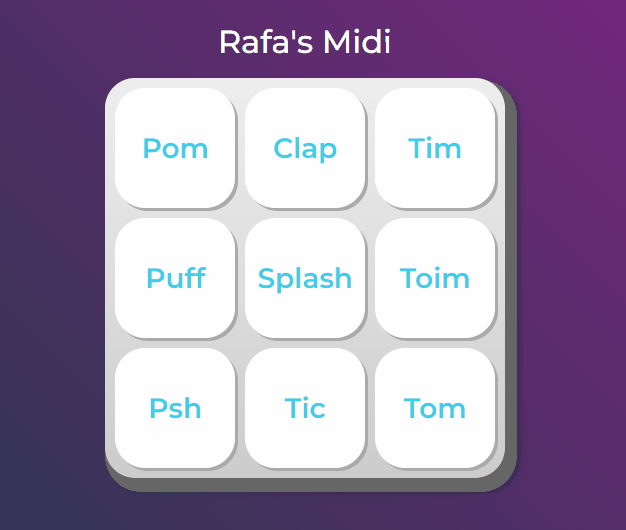

# Rafa's Midi

Esse projeto tem como objetivo manipular elementos da DOM, executando sons de acordo com a tecla que foi selecionada.

 <a href='#sobre'>Sobre</a>
 <a href='#tecnologias'>Tecnologias</a>
 <a href='#preview'>Preview</a>
 <a href='#pré-requisitos'>Pré-requisitos</a>
 <a href='#autor'>Autor</a>

# Sobre

Projeto que tem como objetivo manipular elementos da DOM, utilizando de uma Midi que de acordo com a tecla apertada, irá ter sons diferentes. Exercício usado para reforçar os aprendizados adquiridos, associando o javascript com o HTML através da DOM

# Tecnologias

   Javascript
  HTML5
 CSS3
# Preview
<h1 align="center">
    
</h1>

# Pré-requisitos
Antes de começar, é bom ter um bom editor para trabalhar com o código como:
[VSCode](https://code.visualstudio.com) ou [Sublime](https://www.sublimetext.com/).

# Autor
Rafael Pino

